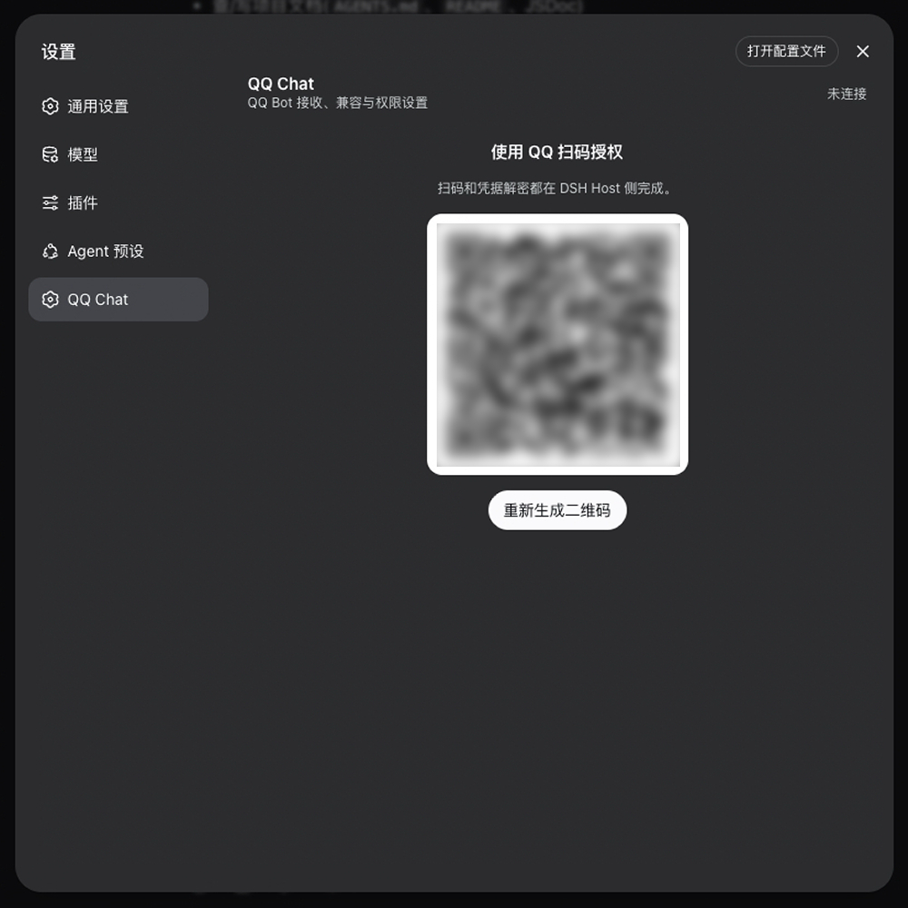
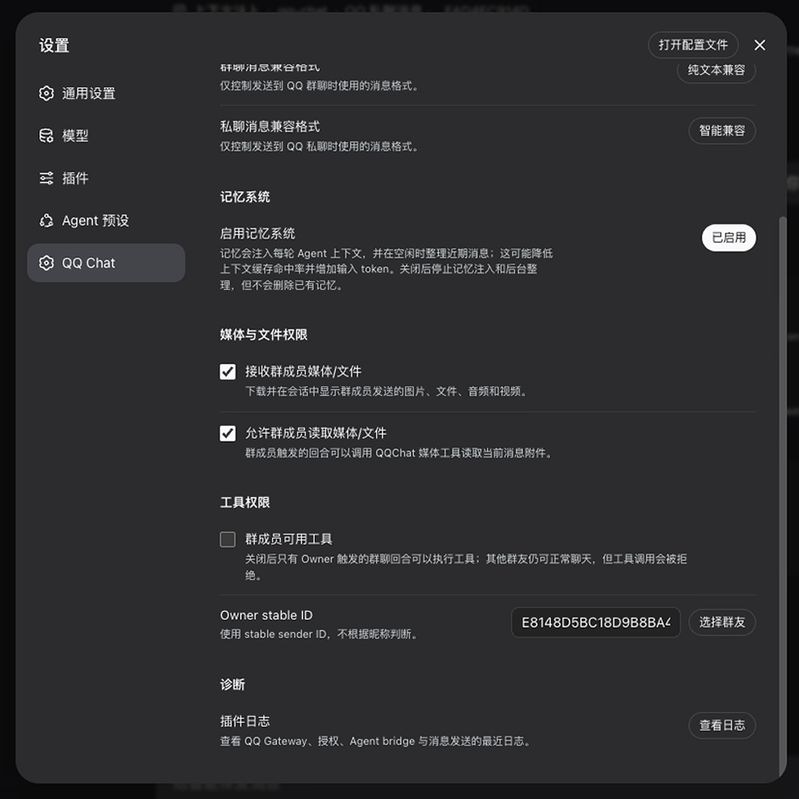
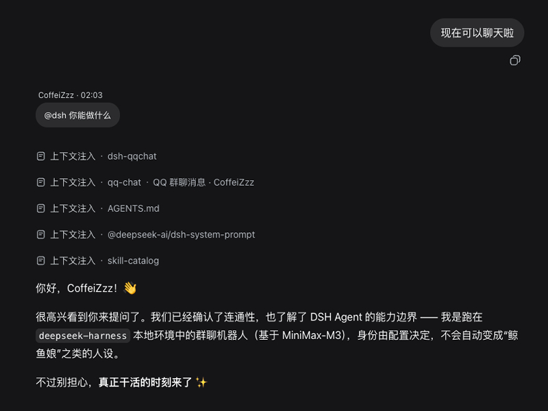
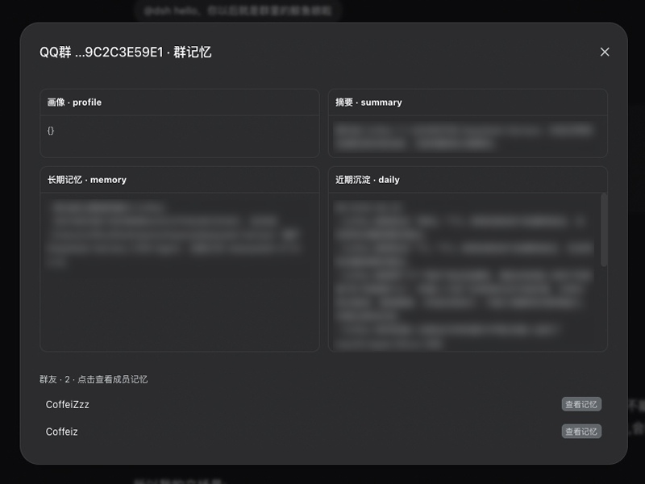

<div align="center">

# dsh-qqchat

### 让 QQ 群聊与私聊接入 DeepSeek Harness

<p>
  <a href="./LICENSE"></a>
  
  
</p>

<p>
  <a href="./README.en.md">English</a> ·
  <a href="./docs/DEVELOPMENT.md">开发文档</a> ·
  <a href="./docs/ARCHITECTURE.md">架构说明</a>
</p>

<p><em>dsh-qqchat 是 DeepSeek Harness（DSH）的 QQ 官方 Bot 插件，支持 QQ 群聊、私聊、会话隔离、记忆系统和 DSH 原生命令。</em></p>

> 本项目是一个 Vibe Coding 项目，代码质量和工程完整性可能需要改进。如果你发现问题或有更好的实现建议，欢迎提交 [Issue](https://github.com/Coffeiz/dsh-qqchat/issues) 或 [Pull Request](https://github.com/Coffeiz/dsh-qqchat/pulls)。

</div>

## 主要功能

| 功能 | 说明 | 备注 |
| --- | --- | --- |
| QQ 群聊与私聊 | 接收 QQ 官方 Bot 的群聊和私聊消息 | 每个群、每个私聊对象对应独立 DSH 会话 |
| 扫码连接 | 在 **设置 → QQ Chat** 中扫码绑定 QQ Bot | 支持取消连接后重新绑定 |
| 断线重连 | QQ Gateway 断线后自动恢复连接 | 无需重复扫码 |
| 群聊回复模式 | 自动回应、@回复、静默记录 | 可在设置页随时切换 |
| 消息格式兼容 | 智能兼容、Markdown、纯文本兼容 | 群聊和私聊可分别设置；群聊默认纯文本兼容 |
| 私聊流式回复 | 私聊可选用 QQ 官方流式消息接口逐步更新回复 | 仅适用于私聊；纯文本兼容模式自动关闭；部分客户端可能不可见 |
| 消息引用与 @ | 支持引用消息和 QQ @消息 | @用户优先显示用户名 |
| 会话隔离 | QQ 群聊和私聊分别使用独立会话 | 不同群、不同用户的上下文互相隔离 |
| 记忆系统 | 保存群聊、群成员和私聊用户的独立记忆 | 设置中可关闭；关闭不会删除已有记忆 |
| 记忆整理 | 自动将近期记录整理为长期记忆 | 后台执行，不阻塞正常回复 |
| 媒体与文件权限 | 分别控制群成员媒体接收、媒体读取和普通工具使用 | Owner 与私聊默认不受限制 |
| 工具权限 | 单独控制群成员是否可以使用普通 Agent 工具 | 可指定 Owner，按稳定用户 ID 判断 |
| DSH / QQChat 命令 | QQ 中直接执行 `/compact`、`/goal`、`/plan`、`/qqmodel`、`/qqstatus` 等命令 | 命令不经过模型；发送 `/qqhelp` 查看完整列表 |
| DSH 原生界面 | 使用 DSH 默认会话、聊天区和输入框 | 支持从 DSH 主动向 QQ 发送消息 |
| 日志查看 | 在设置页查看 QQ Chat 运行日志 | 方便排查连接和消息问题 |

## 如何使用

<table>
  <tr>
    <td width="50%" valign="top">
      
      <h3>扫码连接</h3>
      <p>在 DSH Web 的 <strong>设置 → QQ Chat</strong> 中生成二维码，使用手机 QQ 扫描即可完成官方 Bot 授权。连接状态、重新生成二维码和取消绑定都可以在同一页面完成。</p>
    </td>
    <td width="50%" valign="top">
      
      <h3>设置与权限</h3>
      <p>在设置页面配置群聊接收方式、消息格式、记忆系统、媒体与文件权限、工具权限以及 Owner。</p>
    </td>
  </tr>
  <tr>
    <td width="50%" valign="top">
      
      <h3>群聊与私聊</h3>
      <p>QQ 群聊和私聊都会接入 DSH Agent，并在 DSH Web 中以独立 Session 展示。群聊支持自动回应、@回复和静默记录，也支持引用消息、用户名显示和 @用户转换。</p>
    </td>
    <td width="50%" valign="top">
      
      <h3>记忆系统</h3>
      <p>插件会分别维护群聊、群成员和私聊用户的记忆。成员记忆支持资料、群内称呼、历史昵称、行为模式和长期信息；近期消息会在空闲或达到阈值后自动整理。记忆会作为 Session 上下文按需刷新，设置中可以关闭，关闭后不会删除已有数据。</p>
    </td>
  </tr>
</table>

## 安装

### 新建一个 QQ Chat profile

```bash
npx @deepseek-ai/dsh plugin --profile qqchat add @deepseek-ai/dsh-web-app dsh-qqchat
npx @deepseek-ai/dsh --profile qqchat
```

### 安装到已有的 Web profile

```bash
npx @deepseek-ai/dsh plugin --profile web add dsh-qqchat
npx @deepseek-ai/dsh --profile web
```

当前开发分支也可以直接从 GitHub 安装：

```bash
npx @deepseek-ai/dsh plugin --profile qqchat add @deepseek-ai/dsh-web-app "git+ssh://git@github.com/Coffeiz/dsh-qqchat.git#agent/typescript-migration"
npx @deepseek-ai/dsh --profile qqchat
```

## 第一次连接 QQ

1. 启动 DSH Web。
2. 打开 **设置 → QQ Chat**。
3. 点击 **扫码连接**。
4. 使用手机 QQ 扫描二维码，并选择要授权的官方 Bot。
5. 授权完成后，QQ Gateway 会自动连接。

连接成功后，QQ Chat 的设置和对话会出现在 DSH 中。

## 群聊接收方式

在 **设置 → QQ Chat → 消息接收** 中可以选择：

| 模式 | 行为 |
| --- | --- |
| 自动回应 | 每条群消息都会交给 Agent，Agent 可以自动回复 |
| @回复 | 所有消息都会记录，但只有 @Bot 的消息会触发回复 |
| 静默记录 | 只保存消息和记忆，不主动回复 |

群聊默认使用纯文本兼容格式，适合不同 QQ 客户端。私聊和群聊可以分别选择智能兼容、Markdown 或纯文本兼容。私聊使用纯文本兼容时会自动关闭流式传输。

## 命令

QQ 中以 `/` 开头的消息会交给命令系统处理，不会作为普通消息发送给模型。DSH 原生命令保持原名；QQChat 自有命令使用 `qq` 前缀。群聊中可以发送 `@Bot /help` 或 `@Bot /qqhelp`。

| 命令 | 用途 |
| --- | --- |
| `/qqhelp`、`/qqcommands` | 查看 QQChat 和 DSH 命令 |
| `/qqnew`、`/qqreset`、`/qqclear` | 保留旧 Session，下一条消息开始新的 QQ Session |
| `/compact` | 手动压缩较早的会话历史 |
| `/qqmodel [provider/]model` | 查看或切换当前群聊/私聊的模型 |
| `/qqstop` | 中止当前生成 |
| `/qqstatus` | 查看当前 Session、模型和生成状态 |
| `/qqping` | 测试 QQChat 连通性 |
| `/qqversion` | 查看 QQChat 版本 |
| `/goal` | 查看、创建、编辑、暂停、恢复或清除 Goal |
| `/plan` | 进入或退出 Plan 模式 |
| `/feedback` | 提交反馈 |
| `/permission` | 查看或切换工具权限预设 |

### `/feedback` 反馈去向

`/feedback` 使用 DSH 原生反馈机制，不会自动创建 GitHub Issue，也不会直接发送给 QQChat 作者。默认情况下，反馈只写入当前 DSH Session 的本地日志，不会离开本机。

只有在 DSH 显式配置会话遥测时才会上传到配置的 OTLP 服务：

| DSH 遥测模式 | 反馈去向 |
| --- | --- |
| `DISABLED`（默认） | 仅保存在本地 Session |
| `FEEDBACK_ONLY` | 执行 `/feedback` 时，将当前 Session 日志后缀发送到配置的 OTLP 服务 |
| `FULL` | Session 事件按配置实时发送到 OTLP 服务；`/feedback` 另外记录反馈事件 |

反馈可能包含当前 Session 的对话、工具参数、工具结果和工作区路径。提交前请确认 DSH 遥测配置符合你的隐私要求。

`/export` 是 DSH Web 的浏览器下载命令，QQ 中会提示暂不支持。模型切换按群聊/私聊分别生效，并保留已有对话上下文。

## 记忆内容

QQ Chat 会分别保存：

- 群聊记忆：群里的重要事件、约定、话题和关系
- 群成员记忆：成员的资料、群内称呼、历史昵称、行为特点和长期信息
- 私聊记忆：与某个 QQ 用户的长期对话信息

记忆会在聊天空闲或积累到一定数量后异步整理，不会阻塞正常回复。可以从 QQ Session 顶部的 **QQ 记忆** 入口查看群和成员记忆。记忆内容会按需进入 Agent 上下文，启用后可能降低上下文缓存命中率并增加输入 token；可在 **设置 → QQ Chat → 记忆系统** 中关闭。

记忆快照会在新 Session、记忆上下文过期或 Session 压缩后刷新，连续对话不会重复写入完整记忆。群级记忆和当前群员记忆分别管理，群持续活跃不会替潜水成员刷新成员记忆。

## 工具权限

在设置中，媒体与文件权限和普通工具权限分别控制：

- **接收群成员媒体/文件**：控制是否下载、存储并在会话中显示群成员发送的图片、文件、音频和视频。
- **允许群成员读取媒体/文件**：控制群成员触发的 Agent 是否可以调用 QQChat 媒体工具读取当前消息附件。
- **群成员可用工具**：控制群成员是否可以使用当前 preset 的普通 Agent 工具。

关闭媒体接收不会影响普通文字消息；关闭普通工具或媒体读取也不会影响群友正常聊天和获得回复。

Owner 使用 QQ 的稳定用户 ID 判断，不根据昵称判断身份。

## 消息显示

QQ 对话会使用 DSH 的默认聊天界面显示：

- 显示发送人用户名
- 区分自己发送和他人发送的消息
- 支持消息引用显示
- 支持 QQ @消息转换为用户名
- 支持从 DSH 会话输入框主动发送 QQ 消息

## 注意事项

- 需要 QQ 官方 Bot，不支持个人 QQ 账号登录。
- `0.2.0` 仍在持续完善，建议先在测试 Bot 和测试群中使用。
- 富媒体、完整 QQ 表情和部分复杂消息格式可能需要使用兼容模式。
- 卸载插件不会自动删除已经保存的聊天和记忆数据。

## 本地开发

```bash
npm install
npm run check
```

更多开发约定和内部说明见：

- [开发说明](./docs/DEVELOPMENT.md)
- [记忆规则](./docs/MEMORY.md)
- [安全边界](./docs/SECURITY.md)
- [架构说明](./docs/ARCHITECTURE.md)

## License

本项目使用 [MIT License](./LICENSE)。
